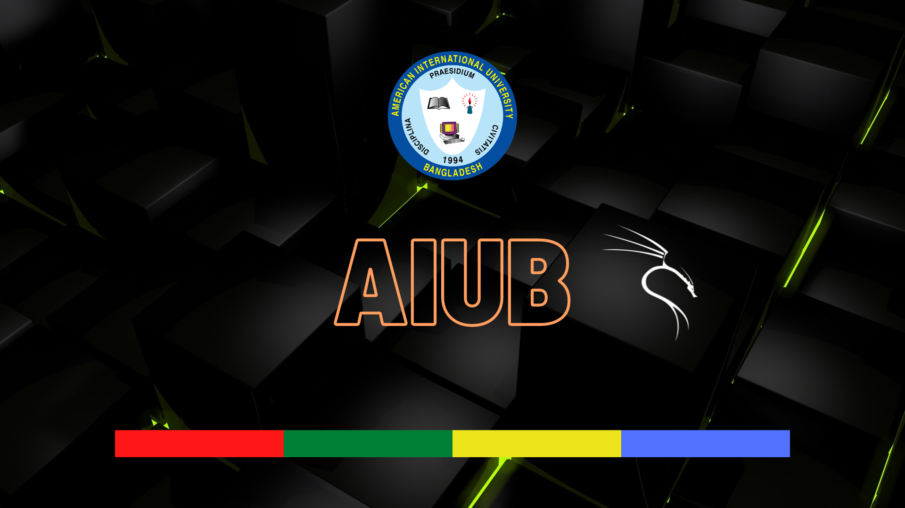
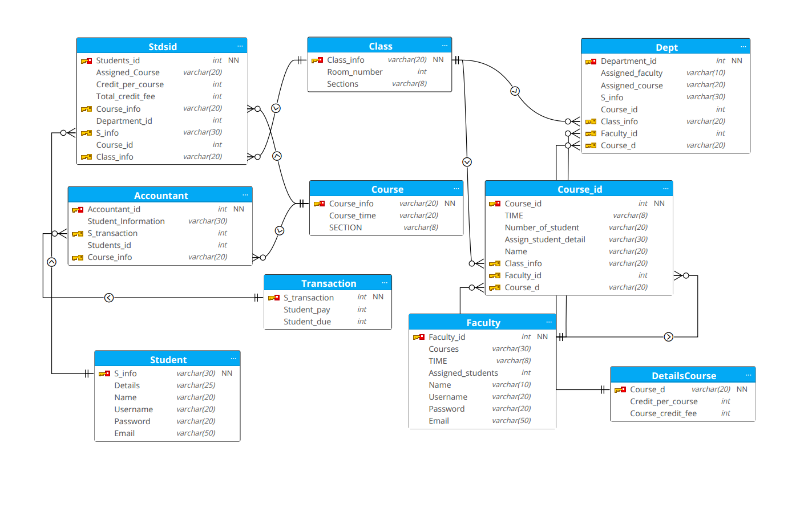
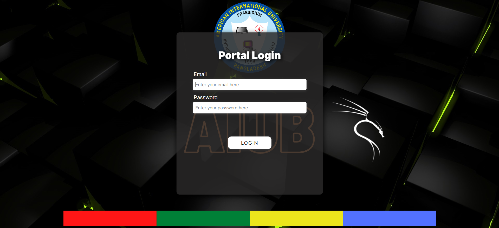
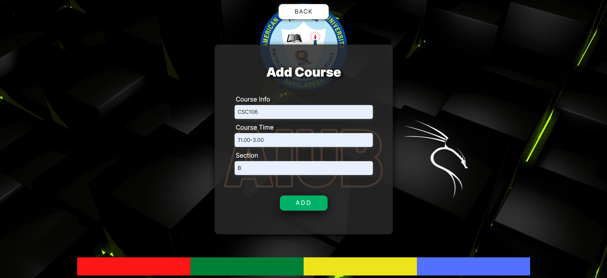
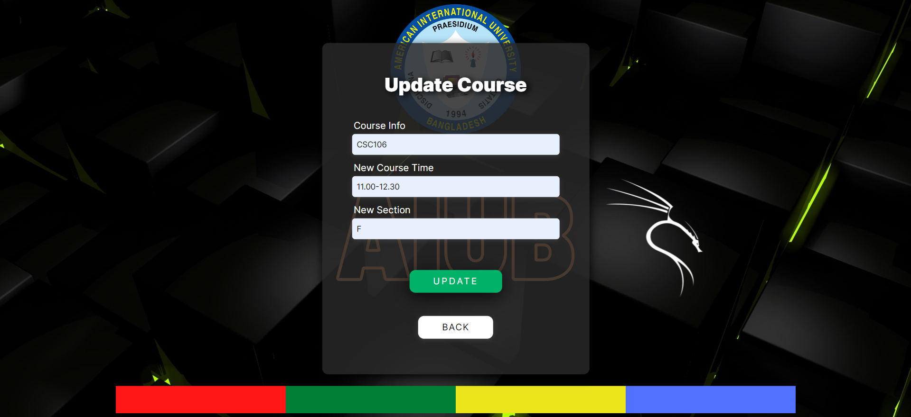
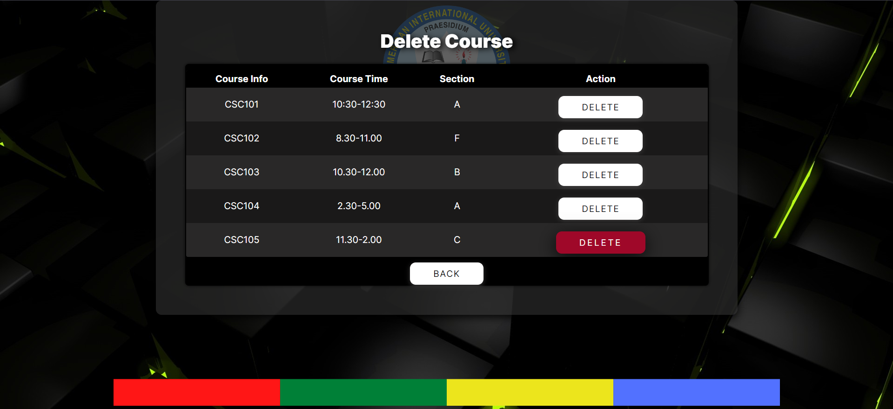
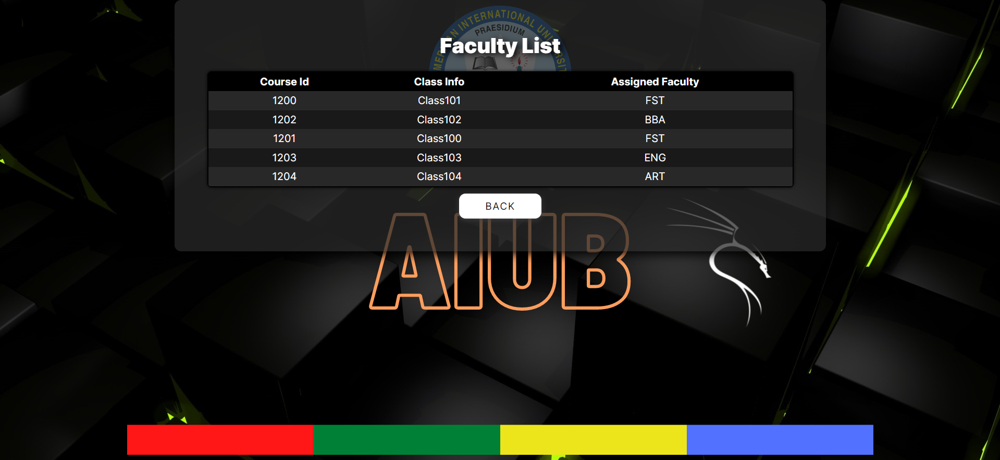

# Course Registration Management System

This is my **CSC 4181: Advance Database Management System** final term project. The best user interface for performing CRUD (Create, Read, Update, Delete) operations for both faculty and students. As an AIUBIAN, I am responsible for creating all of these things. It would be appreciated if anyone who uses them gives credit to me.

### Stacks Used:

- Oracle Database
- PHP
- HTML, CSS, OCI8

### How To Run

1. Enable OCI8 with Xampp, you will find all procedures in this link - [Oracle-Xampp-Connect](https://drive.google.com/drive/folders/1fZGEExw2Qy1LoGU_JXNSlDz_aPf-RJhn?usp=drive_link)
2. Then simply run with Xampp htdocs.

### Background Image

### Schema Diagram

### Screenshots

